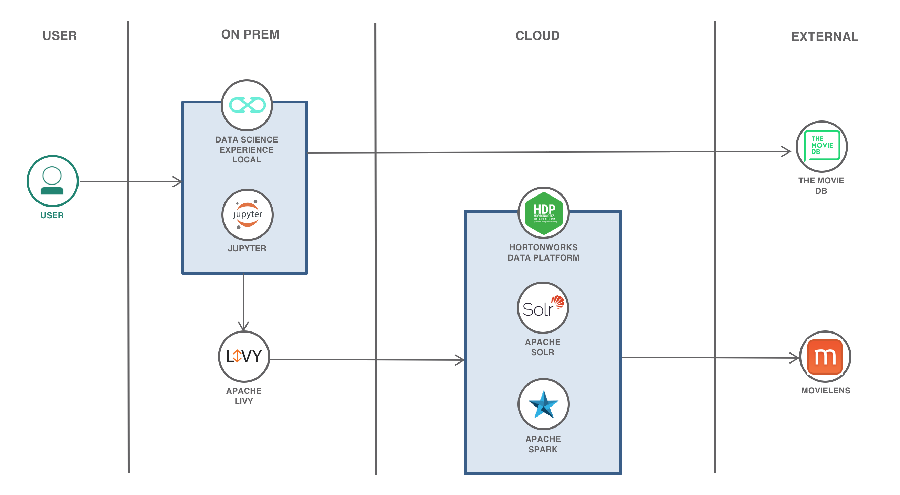

# Building a Recommender using Data Science Experience Local and Hortonworks Data Platform

Recommendation engines are one of the most well known, widely used and highest value use cases for applying machine learning. Despite this, while there are many resources available for the basics of training a recommendation model, there are relatively few that explain how to actually deploy these models to create a large-scale recommender system.

This code pattern demonstrates the key elements of creating such a system by using Apache Spark and HDP Search (Solr). Note that this pattern is a port of Nick Pentreath's [Recommender built with Elasticsearch and Apache Spark](https://github.com/IBM/elasticsearch-spark-recommender), but with a focus on using Hortonworks Data Platform (HDP) and IBM's Data Science Experience Local (DSX Local).

> **What is HDP and HDP Search?** Hortonworks Data Platform (HDP) is a massively scalable platform for storing, processing and analyzing large volumes of data. HDP consists of the essential set of Apache Hadoop projects including MapReduce, Hadoop Distributed File System (HDFS), HCatalog, Pig, Hive, HBase, Zookeeper and Ambari. HDP Search provides applications and tools for indexing content from your HDP cluster to Solr (an open source enterprise search platform).

  

   *Hortonworks Data Platform by [Hortonworks](https://hortonworks.com/products/data-platforms/hdp/)*

> **What is DSX Local?** DSX Local is an on premises solution for data scientists and data engineers. It offers a suite of data science tools that integrate with RStudio, Spark, Jupyter, and Zeppelin notebook technologies. And yes, it can be configured to use HDP, too.

This repo contains a Jupyter notebook illustrating how to use Spark for training a collaborative filtering recommendation model from ratings data stored in Solr, saving the model factors to Solr, and then using Solr to serve real-time recommendations using the model. The data you will use comes from [MovieLens](https://grouplens.org/datasets/movielens/) and is a common benchmark dataset in the recommendations community. The data consists of a set of ratings given by users of the MovieLens movie rating system, to various movies. It also contains metadata (title and genres) for each movie.

When you have completed this code pattern, you will understand how to:

* Ingest and index user event data into Solr using the Solr Spark connector
* Load event data into Spark DataFrames and use Spark's machine learning library (MLlib) to train a collaborative filtering recommender model
* Export the trained model into Solr 
* Using a custom Solr plugin, compute _personalized user_ and _similar item_ recommendations and combine recommendations with search and content filtering

## Flow



1. Load the movie dataset into Apache Hadoop HDFS.
2. Use Spark DataFrame operations to clean the dataset and use Spark MLlib to train a collaborative filtering recommendation model.
3. Save the resulting model into Apache Solr.
4. The user can run the provided notebook in IBM's Data Science Experience Local.
5. As the notebook runs, Apache Livy will be called to interact with the Spark service in HDP.
6. Using Solr queries and a custom vector scoring plugin, generate example recommendations.
7. When necessary, retrieve information about movies, such as poster images, using [The Movie Database](https://www.themoviedb.org/) APIs.

## Included components

* [IBM Data Science Experience Local](https://content-dsxlocal.mybluemix.net/docs/content/local/overview.html): An out-of-the-box on premises solution for data scientists and data engineers. It offers a suite of data science tools that integrate with RStudio, Spark, Jupyter, and Zeppelin notebook technologies.
* [Apache Spark](http://spark.apache.org/): An open-source, fast and general-purpose cluster computing system.
* [Hortonworks Data Platform (HDP)](https://hortonworks.com/products/data-platforms/hdp/): HDP is a massively scalable platform for storing, processing and analyzing large volumes of data. HDP consists of the essential set of Apache Hadoop projects including MapReduce, Hadoop Distributed File System (HDFS), HCatalog, Pig, Hive, HBase, Zookeeper and Ambari.
* [HDP Search](https://doc.lucidworks.com/lucidworks-hdpsearch/2.6/index.html): HDP Search provides applications and tools for indexing content from your HDP cluster to Solr.
* [Apache Livy](https://livy.incubator.apache.org/): Apache Livy is a service that enables easy interaction with a Spark cluster over a REST interface.
* [Jupyter Notebooks](http://jupyter.org/): An open-source web application that allows you to create and share documents that contain live code, equations, visualizations and explanatory text.

## Featured technologies

* [Artificial Intelligence](https://medium.com/ibm-data-science-experience): Artificial intelligence can be applied to disparate solution spaces to deliver disruptive technologies.
* [Python](https://www.python.org/): Python is a programming language that lets you work more quickly and integrate your systems more effectively.

# Prerequisites

## Access to HDP Platform

The core of this code pattern is integrating Hortonworks Data Platform (HDP) and IBM DSX Local. If you do not already have an HDP cluster available for use, you will need to install one before attempting to complete the code pattern. 

To install [HDP v2.6.4](https://docs.hortonworks.com/HDPDocuments/HDP2/HDP-2.6.4/index.html), please follow the [installation guide](https://docs.hortonworks.com/HDPDocuments/Ambari-2.6.1.5/bk_ambari-installation/content/ch_Getting_Ready.html) provided by Hortonworks. It first requires the installation of the [Apache Ambari](https://ambari.apache.org/) management platform which is then used to faciliate the HDP cluster installation. The Ambari Server is also required to complete a number of steps described in the following sections.

> Note: Ensure that your Ambari Server is configured to use `Python v2.7`.

## Install HDP Cluster services

Once your HDP cluster is deployed, at a minimum, install the following services as listed in this Ambari Server UI screenshot:


> Note: 
> 1. This code pattern requires that version `2.2.0` of the `Spark2` service be installed.
> 2. Details on how to install and configure the `Solr` service are discussed in the [Setup HDP Search](#1-set-up-hdp-search) section below.

## Disable Apache Livy CSRF protection

From your Ambari Server UI, disable the Apache Livy server's CSRF proctection by changing the `livy.server.csrf_protection.enable` variable to `false`. To navigate to the panel, click on the `Spark2` service, then the `Configs` tab, and then open the `Advanced livy2-conf` section.


# Steps
Follow these steps to setup the proper environment to run our Recommender notebook locally.

1. [Setup HDP Search](#1-set-up-hdp-search)
2. [Download and install the Solr Spark connector](#2-download-and-install-the-solr-spark-connector)
3. [Setup DSX Desktop](#3-setup-dsx-desktop)
4. [Clone the repo](#4-clone-the-repo)
5. [Download and move the data to HDFS](#5-download-and-move-the-data-to-hdfs)
6. [Setup python plugins](#6-setup-python-plugins)
7. [Launch the notebook](#7-launch-the-notebook)
8. [Run the notebook](#8-run-the-notebook)

### 1. Set up HDP Search

This code pattern was tested with HDP Search (`Solr`) v6.6.2 and assumes that it is started in `cloud mode`. Minimally, this can be accomplished by performing the following steps:

1. Install Solr following the [HDP Solr Search installation instructions](https://docs.hortonworks.com/HDPDocuments/HDP2/HDP-2.6.4/bk_solr-search-installation/content/hdp-search30-install-mpack.html).

1. Verify that the Solr server is running. To accomplish this, either:

   1. Access the Solr admin dashboard:
      ```
      http://solr_host:8983/solr
      ```

      OR

   1. Run the `solr status` command:
      ```
      cd <solr_installation_dir>/solr/bin
      ./solr status
      ```

2. Install the `Solr vector scoring plugin` using the following [instructions](https://github.com/saaay71/solr-vector-scoring). 

    > Note: When making changes to the `solrconfig.xml` and `managed_schema` files, avoid using cut and paste to reduce the chance of unwanted characters being inserted.

    To test out your changes, try out the samples shown in the [Examples](https://github.com/saaay71/solr-vector-scoring#example) section of the plugin's README. This will require you to create test collections - see the [Running Solr Docs](https://lucene.apache.org/solr/guide/6_6/running-solr.html#running-solr) for instructions on how to do that.
    
3. Re-start the Ambari server:

    ```
    ambari-server restart
    ```

### 2. Download and install the Solr Spark connector

This code pattern reads the movie data set and computes the model vectors using `Spark`. The Spark dataframes representing the movie data set and model vectors are then written to `Solr` using the `Solr Spark connector`. The Solr connector for Spark can be downloaded from the [Lucidworks' Spark-Solr repository](https://github.com/lucidworks/spark-solr).

> This code pattern was tested with version 3.5.1 of the connector. The Spark configurations need to be changed to add the connector jars in the Spark driver and executor classpath. This can be done by following the steps below.

> Special consideration: The Solr connector jar is available in two flavors. The first one (non-shaded) only carries classes specific to the connector. The second one (shaded) carries the connector specific classes along with all its dependencies. Ideally, we would want the shaded version that contains the dependency classes. However, it contains the full set of Spark and Scala classes which will conflict with the Spark runtime when it is  specified in the Spark classpath. To work around this problem, we will need to remove all of the Spark and Scala classes from this jar. 

To download and install the connector:

  1. Download the [jar](http://search.maven.org/#artifactdetails%7Ccom.lucidworks.spark%7Cspark-solr%7C3.5.1%7Cjar) to a backup directory
  2. Create a temporary work directory and `cd` to it
  3. Extract the jar using `jar -xvf <location of jar file>`
  4. Run `rm -rf scala`
  5. Run `rm -rf org/apache/spark`
  6. Rebuild the jar by using `jar -cvf spark-solr-3.5.1-shaded-modified.jar *`
  7. Log into the Ambari Server UI
  8. Select the `Spark2` service and select the `Configs` tab
  9. Open the `Custom spark2-defaults` properties section
  10. Add the following property keys:
      * `spark.driver.extraClassPath`
      * `spark.executor.extraClassPath`
      * `spark.jars`
  11. Set the key values to the path of the `Spark Solr connector jar` (e.g. `/home/user1/spark-solr-3.5.1-shaded-modified.jar`).

> Note: In the example above, the path is a local system path. In case of a multi-node HDP cluster, please make sure that this jar is available under the same path on all of the nodes. Another option is to put the jar in HDFS and specify the HDFS location.

### 3. Setup DSX Desktop 

This code pattern was tested using [DSX Desktop](https://www.ibm.com/products/data-science-experience), a lightweight version of DSX Local intended for standalone use and optimized for local development. For information on how to set it up, see the [DSX Desktop Install Docs](https://content-dsxdesktop.mybluemix.net/docs/content/desktop/install.html). 

For production deployments it is recommended to use `DSX Local` with a three node configuration. For more information, refer to the [DSX Local Installation Guide](https://content-dsxlocal.mybluemix.net/docs/content/local/welcome.html).

When installing `DSX Desktop`, choose `Jupyter Notebooks` with `Anaconda (Python 2.7)`.
     
  

### 4. Clone the repo

Now that our HDP and DSX Local are installed and configured, we can proceed with making the two communicate with each other. We start by cloning the `hdp-search-spark-recommender` repository locally. In a terminal, run:

```
git clone https://github.com/IBM/hdp-search-spark-recommender.git
cd hdp-search-spark-recommender
```

### 5. Download and move the data to HDFS

In this code pattern we will be using the [Movielens dataset](https://grouplens.org/datasets/movielens/), it contains ratings given by a set of users for movies, as well as movie metadata. For the purpose of this code pattern, we can download the ["latest small" version](http://files.grouplens.org/datasets/movielens/ml-latest-small.zip) of the data set.

This code pattern is targeted to run against a multi-node HDP cluster. Therefore, the dataset needs to be moved to HDFS. Move the data to HDFS by issuing the following commands from the Ambari Server:

```
mkdir /tmp/data
cd /tmp/data
wget http://files.grouplens.org/datasets/movielens/ml-latest-small.zip
unzip ml-latest-small.zip
hadoop fs -mkdir /movies
hadoop fs -put *.csv /movies
```

### 6. Setup python plugins

This code pattern relies upon a few python plugins for everything to work together. Some plugins are required to be installed in the node where DSX Local or DSX Desktop is installed and the others need to be installed in all the HDP compute nodes. The following table lists which plugins are required and where they need to be installed:

| Library | Install Location |
| ------------- | ------------- |
| tmdbsimple | DSX Node |
| IPython  | DSX node |
| paramiko | All nodes of HDP cluster | 
| numpy | All nodes of HDP cluster |
| simplejson | DSX node and all nodes of HDP cluster |
| urllib2 | DSX node and all nodes of HDP cluster |
| solrcloudpy | DSX node and all nodes of HDP cluster |

The plugins can be installed using the pip command.

> If the `pip` command is not available on your platform, please follow the platform specific instructions to install pip on your machine.   

For example:

```
pip install numpy
```

> Special Consideration: It can be a little tricky to install the plugins required on DSX Desktop. The notebook attempts to install the plugins in the user environment automatically.
Occasionally it will fail due to the presence of multiple python environments in the docker container that runs the notebook. If this occurs, we can install the plugins manually by performing the following steps:

1. Find out the python environment that is used by the notebook by inserting a cell at the top of the notebook. Enter and run the following commands:
   ```
   !!which python
   !!which pip
   ```
2. In a terminal, type `docker ps` to list all the docker containers.
3. Find out the container id of your notebook by looking for the image name `dsx-desktop:ana27`.
4. Start a interactive bash shell on the container by running the following command:
    ```
    docker exec -it <container_id>
    ```
5. At the prompt, enter the following command to install `solrcloudpy` (this example assumes that the `pip` command location determined by Step 1 is `/opt/conda/bin/pip`): 
   ```
   /opt/conda/bin/pip install --ignore-installed -U solrcloudpy
   ```
6. Repeat the previous step for all remaining plugins.

> Note: Some of the plugins may already be installed/present in your environment. In that case please skip that plugin and move on to the next plugin in the table. Similarly, installing the plugins may require installing some prerequsite plugins on your platform. In this case, please follow the platform specific instuctions to install the prerequsite plugins first.

### 7. Launch the notebook

> The notebook provided in this repo should work with Python 2.7.x or 3.x (and has been tested on 2.7.11 and 3.6.1)

To run the notebook you will need to start DSX Local. Below are the steps that need to be performed before running the notebook the very first time.

1. Create a new project.

    * From the DSK Desktop dashboard, click on `Create project`.

      
  
    * Give the project a name and click the `Create` button.

      

1. Create the notebook.

    * From the project dashboard view, click on `Create notebook`.

      

    * Select the `From URL` tab to specify the URL to the notebook in this repository.

      

    * Enter this URL:

        ```
        https://raw.githubusercontent.com/IBM/hdp-search-spark-recommender/master/notebooks/solr-hdp-spark-recommender.ipynb
        ```
    
    * Click the `Create` button.

1. Load the notebook.

    Once created, you can click on the notebook to load and run it. Once running, you will see a number of variables that need to be replaced with values that match your installed environment. These variables are:

        * `LIVY_URL`
        * `HDFS_URL_FOR_DATA`
        * `SOLR_INSTALL_DIR`
        * `SOLR_HOST`
        * `SOLR_PORT`
        * `ZKHOST`
        * `SSHUSER`
        * `SSHPASSWORD`
        * `tmdb.API_KEY`

      > Note: Some variables such as tmdb.API_KEY, SOLR_HOST etc are defined two times in the notebook as they are needed in the DSX node and Livy node. Please make sure to update all the occurrence of the specific variable in the notebook.

### 8. Run the notebook

When a notebook is executed, what is actually happening is that each code cell in
the notebook is executed, in order, from top to bottom.

Each code cell is selectable and is preceded by a tag in the left margin. The tag
format is `In [x]:`. Depending on the state of the notebook, the `x` can be:

* A blank, this indicates that the cell has never been executed.
* A number, this number represents the relative order this code step was executed.
* A `*`, this indicates that the cell is currently executing.

There are several ways to execute the code cells in your notebook:

* One cell at a time.
  * Select the cell, and then press the `Play` button in the toolbar. You can also hit `Shift+Enter` to execute the cell and move to the next cell.
* Batch mode, in sequential order.
  * From the `Cell` menu bar, there are several options available. For example, you
    can `Run All` cells in your notebook, or you can `Run All Below`, that will
    start executing from the first cell under the currently selected cell, and then
    continue executing all cells that follow.


# Sample output

After classifying the data by movies, ratings and genres, we train our recommender model. 


After loading our model into Solr, we can predict which movies people will like based on ratings of similar movies in the same genre.


The example output in the [data/examples](data/examples) folder shows the output of the notebook after running it in full. View it [here](data/examples/solr-hdp-spark-recommender.ipynb).

# Troubleshooting

* Error: `Should DSX Desktop fail to respond at any time.`
  > Solution: Perform the following steps:

    	* Close IBM DSX desktop
    	* Kill all the processes related to DSX Local from terminal:

      	```
    	docker ps |grep dsx
    	docker rm -f <container id>
    	```

  	* Remove DSX Desktop metadata

    	```
    	cd ~/Library/Application \Support/
    	rm -rf ibm-dsx-desktop
    	```

  	* Restart DSX Desktop
  	* Load the jupyter notebook again

* Error: `Missing Required Header for CSRF protection.`

   If you see this error when trying to create spark session through livy (the cell below), it means that you need to disable the CSRF in the livy property.   
   ```
   livyURL="http://host name:8999"
   %spark add -s spark -l python -u $livyURL
   ``` 

  > Solution: Go to the [Disable Apache Livy CSRF protection](#disable-apache-livy-csrf-protection) section for instructions.

* Error: `404 Client Error: Not Found for url: http://your hostname:8983/solr/ratings/schema`
 
	If you see this error when running this cell
  	```
  	%%spark
  	setupSchema()
  	conn = SolrConnection(SOLR_HOST_PORT, version="6.6.0")
  	```
  
 	go to Solr's UI, and click the `Logging` on the left side, and check the latest logs, if showing
  
  	Error: `org.apache.solr.common.SolrException: Error CREATEing SolrCore 'movies_vector_shard1_replica1': Unable to create core [movies_vector_shard1_replica1] Caused by: /solr/movies_vector/core_node    1/data/index/write.lock for client 172.17.0.2 already exists`
  
  > Solution: Find your solr data/index directory which is specified in `conf/solrconfig.xml`, delete only the write.log in data/index folder.

* Error: `HTTPError: 401 Client Error: Unauthorized for url: https://api.themoviedb.org/3/movie/1893?api_key=...`

  If you see this error in your notebook while testing your TMDb API access, or generating recommendations, it means you have installed `tmdbsimple` Python package, but have not set up your API key.

  > Solution: You will need to access [The Movie Database API](https://www.themoviedb.org/documentation/api) and follow theses [instructions](https://developers.themoviedb.org/3/getting-started) to get an API key. Then copy the key into the `tmdb.API_KEY = 'YOUR_API_KEY'` line in the notebook. Once you have done that, execute that cell to test your access to TMDb API.
  
# Links

* [Teaming on Data: IBM and Hortonworks Broaden Relationship](https://hortonworks.com/blog/teaming-data-ibm-hortonworks-broaden-relationship/)
* [Certification of IBM Data Science Experience (DSX) on HDP is a Win-Win for Customers](https://hortonworks.com/blog/certification-ibm-data-science-experience-dsx-hdp-win-win-customers/)
* [An Exciting Data Science Experience on HDP](https://hortonworks.com/blog/exciting-data-science-experience-hdp/)

# Learn more

* **Data Analytics Code Patterns**: Enjoyed this Code Pattern? Check out our other [Data Analytics Code Patterns](https://developer.ibm.com/code/technologies/data-science/)
* **AI and Data Code Pattern Playlist**: Bookmark our [playlist](https://www.youtube.com/playlist?list=PLzUbsvIyrNfknNewObx5N7uGZ5FKH0Fde) with all of our Code Pattern videos
* **Watson Studio**: Master the art of data science with IBM's [Watson Studio](https://datascience.ibm.com/)
* **Spark on IBM Cloud**: Need a Spark cluster? Create up to 30 Spark executors on IBM Cloud with our [Spark service](https://console.bluemix.net/catalog/services/apache-spark)

# License
[Apache 2.0](LICENSE)
